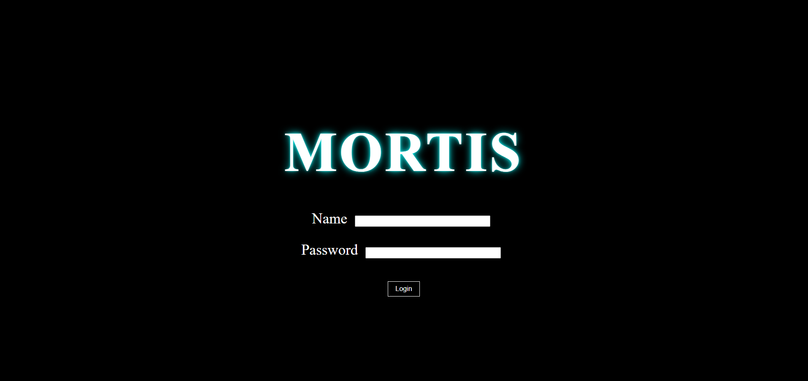
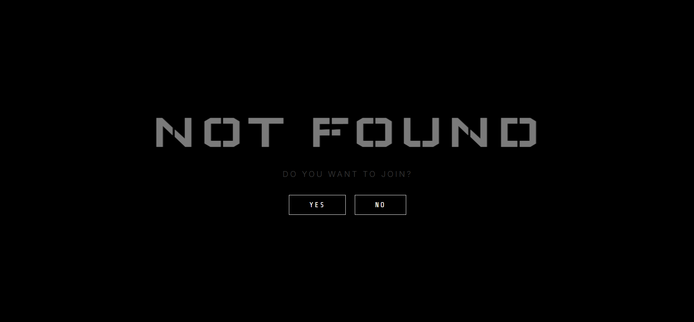
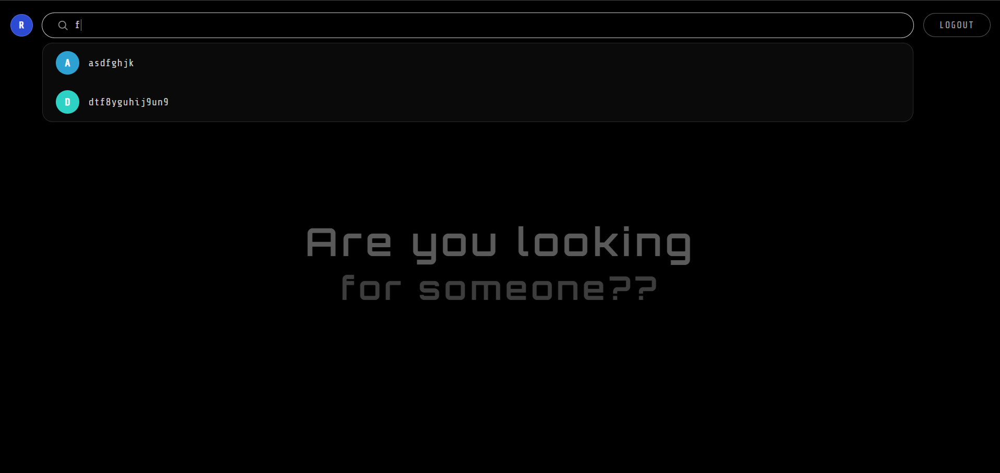
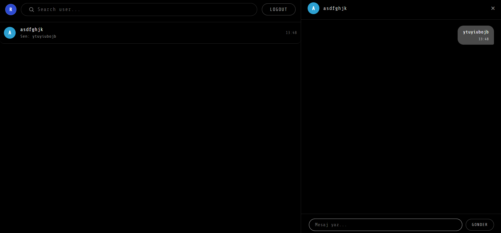

# Mortis

Mortis is a real-time, one-to-one messaging demo built with Flask, SQLAlchemy, and Socket.IO.

## Features

- Real-time one-to-one messaging
- Browser-based end-to-end encryption prototype
- Flask backend with MySQL storage
- Docker Compose setup for running the app locally

## Screenshots

| Login | Join consent |
|:---:|:---:|
|  |  |

| Contacts | Conversation |
|:---:|:---:|
|  |  |
## End-to-End Encryption Prototype

New messages are encrypted in the browser using AES-256-GCM. The encryption key is derived through ECDH P-256 with the Web Crypto API.

The Flask application receives public identity keys, encrypted message envelopes, and messaging metadata such as sender, recipient, and timestamp. It does not receive private keys or message plaintext. A user's private key is stored in that user's browser local storage.

**This is not Signal Protocol and does not claim Signal-level security.** Signal's official design includes PQXDH/X3DH, prekeys, Double Ratchet, evolving message keys, multi-device session management, and long-term secure key storage.

This prototype does not provide forward secrecy, post-compromise recovery, multi-device support, or safety-number verification. For sensitive real-world communications, use a well-audited Signal Protocol client library and obtain independent security audits instead of designing custom cryptography.

## Requirements

For the recommended setup:

- Git
- Docker Desktop with Docker Compose

You do not need to install Python or MySQL to run the app with Docker.

## Run with Docker

Clone the repository and enter the project folder:

```powershell
git clone https://github.com/Javidan-Qasimov/Mortis.git
cd Mortis
Copy-Item .env.example .env
```

Open `.env` and replace the placeholder secret and passwords with strong, unique values. Keep `.env` private and do not commit it to GitHub.

Build and start the app:

```powershell
docker compose up --build
```

Open [http://localhost:5000](http://localhost:5000) in your browser. The app is bound to localhost and is accessible from your computer only.

To stop the app, press `Ctrl+C`. If you started it in the background, run:

```powershell
docker compose down
```

To also delete the database volume and its data:

```powershell
docker compose down -v
```

### Start Adminer

Adminer is an optional database management tool. Start it with:

```powershell
docker compose --profile tools up -d
```

Then open [http://localhost:8080](http://localhost:8080).

## Run with Python

This option requires Python and a MySQL server to be installed and running.

Create and activate a virtual environment, then install the project dependencies:

```powershell
python -m venv .venv
.\.venv\Scripts\Activate.ps1
pip install -r requirements.txt
```

Copy the example environment file:

```powershell
Copy-Item .env.example .env
```

Edit `.env` and set the database connection values for your local MySQL server. For a MySQL server running on your computer, set:

```ini
DB_HOST=127.0.0.1
DB_PORT=3306
```

Make sure the MySQL database and user in `.env` exist and that the user has access to the database.

From the project root, start the app with:

```powershell
python app.py
```

Open [http://localhost:5000](http://localhost:5000). Stop the server with `Ctrl+C`.

## Production Deployment

GitHub hosts the source code; it does not run the application. To make the app available over the internet, deploy it to a server that remains online.

A typical setup uses a VPS running Docker and Docker Compose, with the application behind an HTTPS-enabled reverse proxy such as Caddy or Nginx.

For production, configure secure environment values, including:

```ini
APP_ENV=production
FLASK_DEBUG=false
SESSION_COOKIE_SECURE=true
AUTO_CREATE_SCHEMA=false
```

Use HTTPS and a production WSGI/ASGI server. Do not expose Flask's built-in development server directly to the internet.

## Database Schema Changes

For the Docker setup, run Flask-Migrate commands inside the web container:

```powershell
docker compose exec web flask --app backend.app db init
docker compose exec web flask --app backend.app db migrate -m "describe change"
docker compose exec web flask --app backend.app db upgrade
```

Use Flask-Migrate for production schema changes instead of relying on `create_all()`.

## Tests

Run the test suite from the project root:

```powershell
pytest
```

The tests use an in-memory SQLite database.

## Security Notes

- `.env` is excluded from Git. Share `.env.example` only.
- MySQL and Adminer ports are bound to localhost in the Docker Compose configuration.
- Forms use CSRF protection. Socket.IO events include recipient validation, message size limits, and per-operation rate limiting.
- Multi-process production deployments should use a shared Socket.IO message queue and a distributed rate-limit backend, such as Redis.

